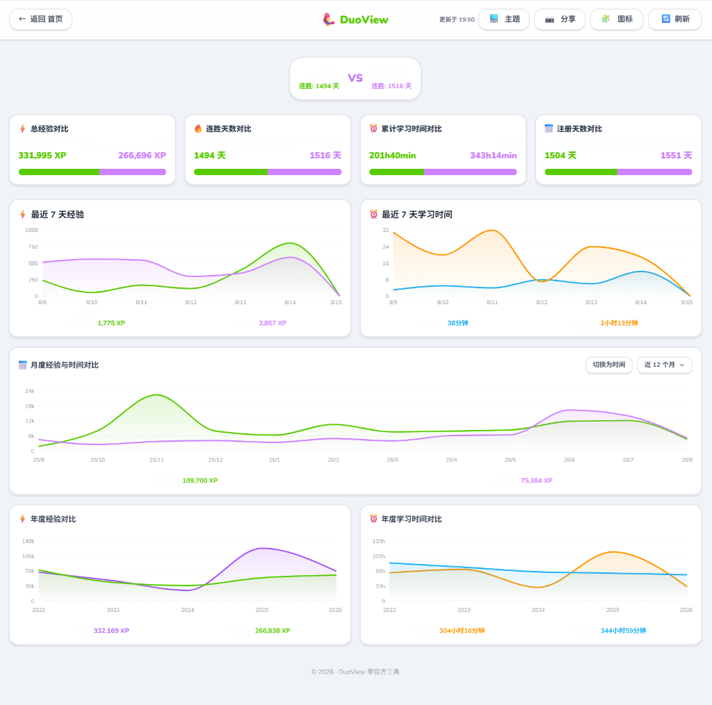

# DuoView

English | [简体中文](./README.md)

> A modern Duolingo learning data dashboard and dual-user comparison tool built with Astro + React + Recharts.

---

## Preview



---

## Features

- **Key Metrics Overview**: Real-time stats on streak days, total XP, enrolled courses, and account age.
- **Dual-User Comparison**: Side-by-side comparative analysis with animated comparison bars and auto-sorting tooltips.
- **Multi-Dimensional Trend Charts**:
  - **7-Day XP & Time**: Area trend charts showing day-by-day XP and study time fluctuations.
  - **Monthly Analysis**: Rolling 12-month view and historical year filtering with quick XP/Time switching.
  - **Yearly Consistency**: Longitudinal XP and study duration records across years.
- **Yearly Activity Heatmap**: Responsive calendar heatmap supporting flexible year selection.
- **Language & Subject Distribution**: Breakdown of study effort by language with progress bars and course details.
- **Today's Overview**: Live summary of lessons completed, XP earned, and active minutes today.
- **Personalization**:
  - Dual icon sets (Duolingo official emojis vs. clean vector icons).
  - Seamless Light / Dark / System theme switching.
- **One-Click Share Export**: Built-in screenshot generator to export and share high-resolution study summaries.

---

## Project Structure

```text
duoview/
├── assets/                     # Preview screenshots and static assets
├── public/                     # Static files (favicon, manifest, etc.)
├── src/
│   ├── components/             # React components
│   │   ├── dashboard/          # Dashboard charts, stat cards, and heatmaps
│   │   ├── DashboardApp.tsx    # Dashboard core view and routing logic
│   │   ├── LandingHero.tsx     # Homepage landing and search component
│   │   ├── Navbar.tsx          # Top navigation bar
│   │   └── AppIcon.tsx         # Multi-mode icon component
│   ├── layouts/
│   │   └── Layout.astro        # Base Astro page layout
│   ├── pages/
│   │   ├── api/
│   │   │   └── data.ts         # Server-side API aggregation and cache layer
│   │   ├── dashboard.astro     # Dashboard page wrapper
│   │   └── index.astro         # Homepage entry
│   ├── services/
│   │   └── duolingoService.ts  # Duolingo API data parser and sanitization
│   ├── styles/
│   │   ├── duolingoColors.ts   # Duolingo brand color tokens
│   │   └── global.css          # Global stylesheet
│   ├── types.ts                # Global TypeScript definitions
│   └── utils/                  # I18n and general helper utilities
├── astro.config.mjs            # Astro configuration
├── package.json
└── tsconfig.json
```

---

## Requirements

- **Node.js**: `20.x` or `22.x`
- **Package Manager**: `npm` / `yarn` / `pnpm`

---

## Quick Start

### 1. Clone the repository and install dependencies

```bash
git clone https://github.com/Loecedas/duoview.git
cd duoview
npm install
```

### 2. Configure Environment Variables

Copy `.env.example` to `.env`:

```bash
cp .env.example .env
```

Configure your `.env` file:

```env
# Required: Your Duolingo JWT Token (used to fetch public data)
# How to get it: Log in to duolingo.com -> Open DevTools (F12) -> Network tab -> Find any /users request -> Copy the Authorization Bearer Token
DUOLINGO_JWT=your_duolingo_jwt_token
```

### 3. Start Development Server

```bash
npm run dev
```

Open `http://localhost:4321` in your browser.

### 4. Build and Preview

```bash
npm run build    # Build for production
npm run preview  # Preview production build locally
```

---

## License

This project is licensed under the [MIT License](./LICENSE).
